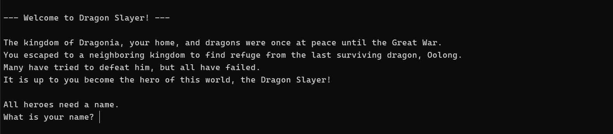
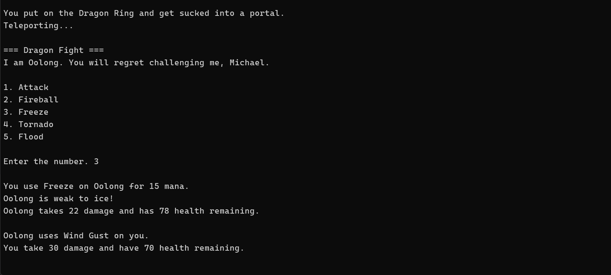

# Dragon Slayer

### Table of Contents

-   [About](#about)
    -   [Tools](#tools)
    -   [Challenges](#challenges)
    -   [What I Learned](#what-i-learned)
-   [Features](#features)
    -   [Weapon or class system](#weapon-or-class-system)
    -   [Radomization of the dragon's abilities](#randomization-of-the-dragons-abilities)
-   [Getting Started](#getting-started)
    -   [Prerequisites](#prerequisites)
    -   [Setup](#setup)
-   [Contact](#contact)

# About

This was my first personal project for Boot.dev. All of the suggested ideas were interesting to me, but I decided to go with a text-based game. It took me one week to complete. I had many ideas for additional features I could've incorporated, but I wanted to continue to the next course and not spend overly long on this.



### Tools


### Challenges

The control flow was probably the hardest part of this game. Getting the behavior I wanted based on certain user interactions, when things did or didn't happen, etc.

I also am not proud of this ridiculous method which I kept adding to throughout this project. This is the worst part of my project, in my opinion. I swear everything else is fairly clean though!

```py
def use_ability(self, ability, target):
    mana_cost = self._calc_mana_cost(ability)
    if self.mana < mana_cost:
        print("Not enough mana.")
        return
    print(f"\nYou use {ability} on {target.name} for {mana_cost} mana.")
    time.sleep(1)
    damage = self._calc_damage(ability, target)
    if target.health <= damage:
        print(f"{target.name} takes {target.health} damage and has {target.health - target.health} health remaining.\n")
        target.health -= target.health
        target.is_alive = target.health > 0
    else:
        target.health -= damage
        print(f"{target.name} takes {damage} damage and has {target.health} health remaining.\n")
```

### What I Learned

This project was a lot of fun to work on. Coding this was almost like playing an actual game, although not quite! It required a surprising amount of code for such a simple game. One thing I think I am getting better at is naming functions as specifically as possible. Otherwise, later I have to go back and change something. I also tried to stay as organized as possible and made each function do the minimal amount of work to make everything more modular (aside from the above method...).

For example, I have two functions named:

```py
def print_weapon_choices():
```

```py
def get_weapon_choice(weapons):
```

Concepts learned/practiced:

-   Getting user input
-   Validating user input
-   Object-oriented programming
-   Functional programming

# Features

### Getting user input & validation

During battle, players are prompted with options to choose from. If they don't enter a number or a number outside of the range, they will be prompted again. I also used the time module to delay execution for a more realistic game experience.

```py
def get_ability_choice(player):
    while True:
        try:
            time.sleep(1)
            choice_num = int(input("\nEnter the number. "))
            if choice_num < 1 or choice_num > len(player.abilities):
                print("The number must be between 1 and 5.")
                continue
            ability_choice = list(player.abilities.keys())[choice_num - 1]
            return ability_choice
        except ValueError:
            print("Input must be a number.")
            continue
```



### Weapon or "class" system

Players can choose from 4 different weapons (or "class"), which will determine the abilities they can use. All classes inherit from the Base class which handles most of the logic, whereas the weapon classes handle the specifics (abilities, element, damage multiplier).

```py
from weapons.base import Base

class Staff(Base):
    def __init__(self, name):
        super().__init__(name)
        self.abilities = {
            "Attack": {
                "mana cost": 0,
                "damage multiplier": 0.5,
                "element": None
            },
            "Fireball": {
                "mana cost": 10,
                "damage multiplier": 1.0,
                "element": "fire"
            },
            "Freeze": {
                "mana cost": 15,
                "damage multiplier": 1.5,
                "element": "ice"
            },
            "Tornado": {
                "mana cost": 15,
                "damage multiplier": 1.5,
                "element": None
            },
            "Flood": {
                "mana cost": 15,
                "damage multiplier": 1.5,
                "element": None
            }
        }

```

The Base class handles most of the behind-the-scenes work, such as calculating the damage:

```py
    def _calc_damage(self, ability, target):
        damage = int(10 * self.abilities[ability]["damage multiplier"])
        if self._is_weak_to(ability, target):
            time.sleep(1)
            print(f"{target.name} is weak to {self.abilities[ability]["element"]}!")
            damage += self._calc_bonus_damage(ability)
        elif self._is_strong_to(ability, target):
            time.sleep(1)
            print(f"{target.name} is strong to {self.abilities[ability]["element"]}!")
            damage -= self._calc_bonus_damage(ability)
        return damage
```

### Randomization of the dragon's abilities

I wanted to make the main fight somewhat interesting. Instead of hardcoding in the abilities the dragon used, I added chances to each of the abilities and used the random module to pick one based on their individual probabilities.

```py
def get_dragon_ability(dragon):
    abilities = list(dragon.abilities.keys())
    chances = [dragon.abilities[ability]["chance"] for ability in abilities]
    dragon_ability = random.choices(abilities, weights=chances, k=1)[0]
    return dragon_ability
```

# Getting Started

### Prerequisites

To get the project running on your machine, you'll need to have the following installed:

-   Python 3.12.2 or higher

### Setup

1. Clone the repository to your local machine:

```
git clone https://github.com/mshortcodes/dragon_slayer.git
```

2. Change into the project directory:

```
cd dragon_slayer
```

3. Run main.py

```py
python main.py
```

# Contact

Michael Short - mshortcodes@gmail.com
